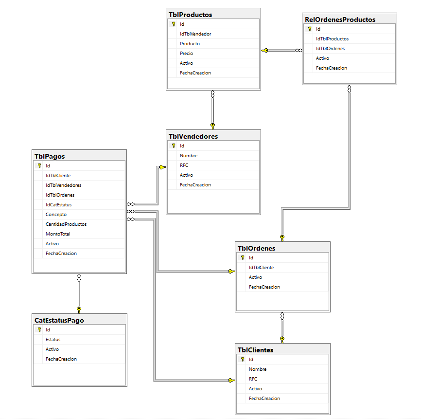
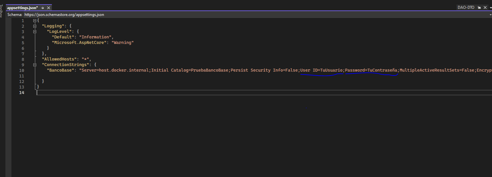

# PruebaBancoBase

Hola soy Sergio Cardoso por medio de este repositorio entrego el examen que se fue asignado.

Me gustaria primero presentar el diagrama de ER  del sistema:

El motor de base de datos utilizado fue SQL SERVER y se agrega el archivo "ScriptBaseDeDatosSQLServer.sql", el cual contiene todo los pasos para crear la base de datos, es importante mencionar que este archivo es el primero que debe ser ejecutado

Agrego tambien el Dockerfile de la API construida con .NET y su archivo de docker-compose, para un facil despliegue en un contenedor docker

**Nota** En la API existe el archivo "appsettings.json" en donde se encuentra actualmente la cadena de conexion a la base de datos, es importante agregar los campos de "User ID" y "Password" del servidor o maquina en la que se ejecutará el contenedor.

Para el patron de sieño me base en una arquitectura de microservicios con programacion por capas utilizando principalmente la inyeccion de dependecias.
Los servicios fueron del tipo REST

No agregue la Coleccion en Postman ya que habilite el swagger de la API y desde ahi es posible hacer las pruebas a los endpoints.

Una vez que este el contenedor corriendo para acceder al swagger y hacer las pruebas es necesario ingresar a esta URL:

http://localhost:8081/swagger/index.html

